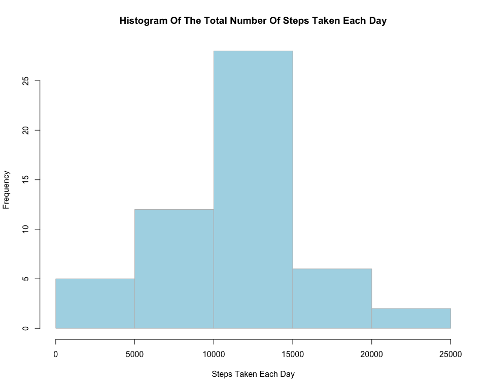
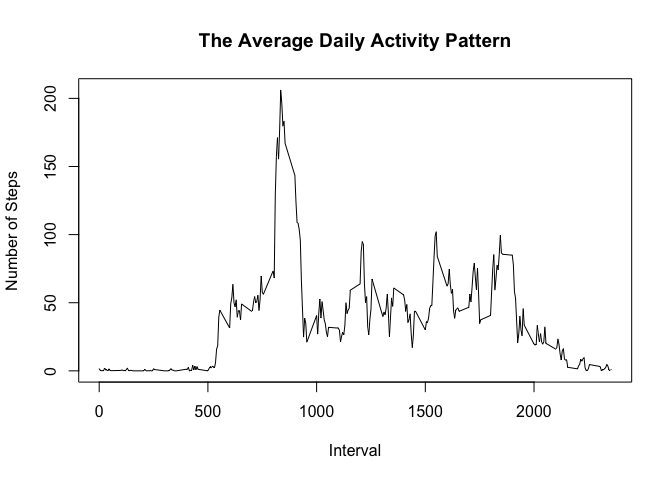

# Reproducible Research: Peer Assessment 1


## Loading and preprocessing the data
1. Load the data

```r
activity <- read.csv("~/Desktop/Coursera/ReproducibleResearch/RepData_PeerAssessment1/activity.csv",
                     stringsAsFactors=FALSE)
```

## What is mean total number of steps taken per day?
1. Calculate the total number of steps taken per day


```r
activity_totalsteps <- aggregate(steps ~ date, data = activity, sum)
```

2. Make a histogram of the total number of steps taken each day


```r
    xname <- "Steps Taken Each Day"
    yname <- "Frequency"
    hist(activity_totalsteps$steps,  
         main   = paste("Histogram Of The Total Number Of", xname), 
         xlab   = xname, 
         ylab   = yname, 
         col    = "lightblue", 
         labels = FALSE,
         axes   = "TRUE",
         plot   = "TRUE",
         border = "gray")
```

<div class="figure" style="text-align: center">

<p class="caption">Histogram of The Total Number of Steps Taken Each Day</p>
</div>

3. Calculate and report the **mean** and **median** total number of steps taken per day


```r
mean(activity_totalsteps$steps)
```

```
## [1] 10766.19
```

```r
median(activity_totalsteps$steps)
```

```
## [1] 10765
```
With no NA removed the mean steps per day is 1.0766189\times 10^{4} and the median steps per day 10765

## What is the average daily activity pattern?
1. Make a time series plot (i.e. type = "l") of the 5-minute interval (x-axis) and the average number of steps taken, averaged across all days (y-axis)


```r
steps_interval <- aggregate(steps ~ interval, data = activity, mean)
plot(steps_interval$interval,
     steps_interval$steps, 
     type="l",
     xlab="Interval",
     ylab="Number of Steps",
     main="Average Daily Activity Pattern")
```

<!-- -->
2. Which 5-minute interval, on average across all the days in the dataset, contains the maximum number of steps?

```r
maxSteps<-steps_interval$interval[which.max(steps_interval$steps)]
```
The 5-min interval, on average across all the days in the dataset that contains the maximum number of steps is 835.

## Imputing missing values

1. Calculate and report the total number of missing values in the dataset (i.e. the total number of rows with 𝙽𝙰s)
Devise a strategy for filling in all of the missing values in the dataset. The strategy does not need to be sophisticated. For example, you could use the mean/median for that day, or the mean for that 5-minute interval, etc.

```r
missing <- length(activity$steps[which(is.na(activity$steps)==TRUE)])
```
   The total number of NA's in the dataset was : 2304

2. Create a new dataset that is equal to the original dataset but with the missing data filled in.

3. Make a histogram of the total number of steps taken each day and Calculate and report the mean and median total number of steps taken per day. Do these values differ from the estimates from the first part of the assignment? What is the impact of imputing missing data on the estimates of the total daily number of steps?


## Are there differences in activity patterns between weekdays and weekends?
