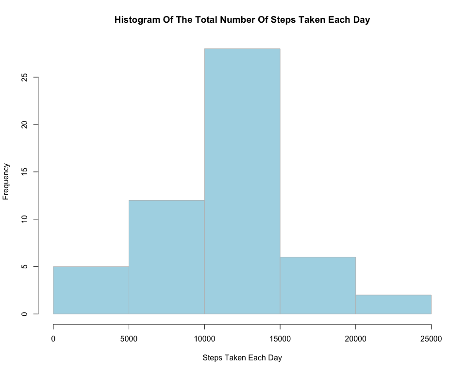
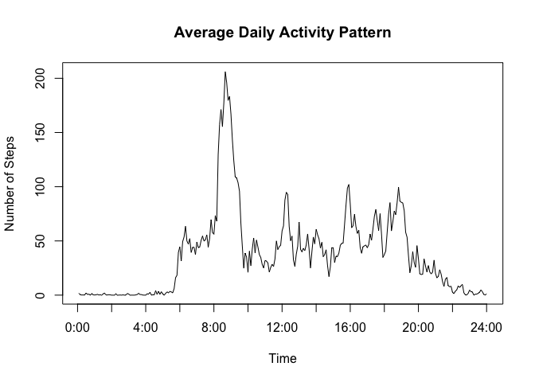
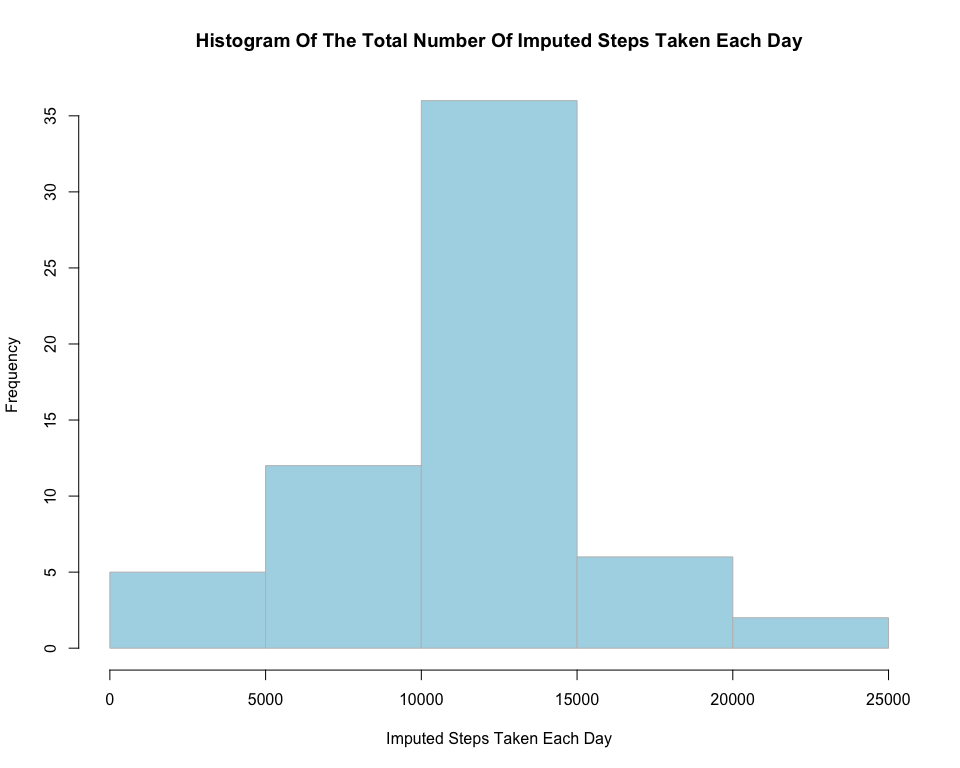
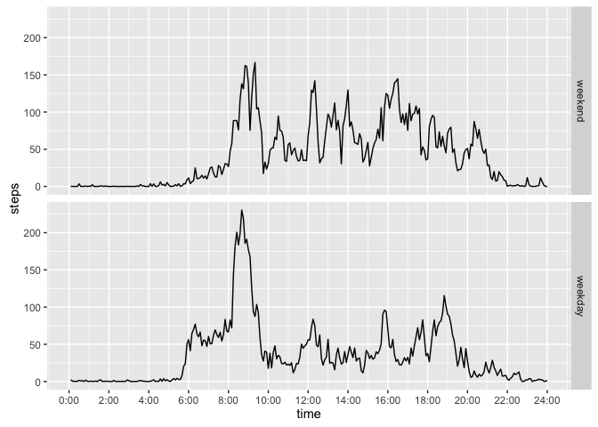

# Reproducible Research: Peer Assessment 1
##Load dependencies

```r
library("ggplot2", lib.loc="/Library/Frameworks/R.framework/Versions/3.2/Resources/library")
options(scipen=999)
```

##Loading and preprocessing the data
####Download, unzip then Load the data


```r
download.file("https://d396qusza40orc.cloudfront.net/repdata%2Fdata%2Factivity.zip", "activity.zip", method= "curl")
unzip("activity.zip")
activity <- read.csv("activity.csv", header=T)
```

##What is mean total number of steps taken per day?
1. Calculate the total number of steps taken per day


```r
activity_totalsteps <- aggregate(steps ~ date, data = activity, sum)
```

2. Make a histogram of the total number of steps taken each day


```r
    xname <- "Steps Taken Each Day"
    yname <- "Frequency"
    hist(activity_totalsteps$steps,  
         main   = paste("Histogram Of The Total Number Of", xname), 
         xlab   = xname, 
         ylab   = yname, 
         col    = "lightblue", 
         labels = FALSE,
         axes   = "TRUE",
         plot   = "TRUE",
         border = "gray")
```

<div class="figure" style="text-align: center">

<p class="caption">Histogram of The Total Number of Steps Taken Each Day</p>
</div>

3. Calculate and report the **mean** and **median** total number of steps taken per day


```r
mean(activity_totalsteps$steps)
```

```
## [1] 10766.19
```

```r
median(activity_totalsteps$steps)
```

```
## [1] 10765
```
With no NA removed the mean steps per day is 10766.19 and the median steps per day 10765

##What is the average daily activity pattern?
1. Make a time series plot (i.e. type = "l") of the 5-minute interval (x-axis) and the average number of steps taken, averaged across all days (y-axis)


```r
steps_interval <- aggregate(steps ~ interval, data = activity, mean)
steps_interval$time<- seq_along(steps_interval$interval)
plot(steps_interval$time,
     steps_interval$steps, 
     type="l",
     xaxt="n",
     xlab="Time",
     ylab="Number of Steps",
     main="Average Daily Activity Pattern")
axis(1, at = (0:12)*24, labels = paste0(c(0:12)*2, ':00'))
```

<!-- -->

2. Which 5-minute interval, on average across all the days in the dataset, contains the maximum number of steps?

```r
maxSteps<-steps_interval$interval[which.max(steps_interval$steps)]
```
Assuming that the intervals begin at midnight and the intervals represent clock times,the 5-min interval, on average across all the days in the dataset that contains the maximum number of steps is 835.

##Imputing missing values

1. Calculate and report the total number of missing values in the dataset (i.e. the total number of rows with 𝙽𝙰s)
Devise a strategy for filling in all of the missing values in the dataset. The strategy does not need to be sophisticated. For example, you could use the mean/median for that day, or the mean for that 5-minute interval, etc.

```r
missing <- sum(is.na(activity$steps))
```
The total number of NA's in the activity dataset was : 2304

2. Create a new dataset that is equal to the original dataset but with the missing data filled in.

####Find out what rows are missing data and assign it to a vector

```r
missing_rows  <- which(is.na(activity$steps))
```
####Create an index to hold the intervals corresponding to missing data

```r
interval_row <- match(activity[missing_rows,"interval"], steps_interval$interval)
```
####Create a df to impute the data

```r
activity_imp <- activity
```
####Impute the missing values to activity_imp using which_missing as the index for the missing values and interval_row as the index for which steps to uses from steps_interval$steps. 

```r
activity_imp[missing_rows,"steps"] <- steps_interval[interval_row,"steps"]
head(activity_imp)
```

```
##       steps       date interval
## 1 1.7169811 2012-10-01        0
## 2 0.3396226 2012-10-01        5
## 3 0.1320755 2012-10-01       10
## 4 0.1509434 2012-10-01       15
## 5 0.0754717 2012-10-01       20
## 6 2.0943396 2012-10-01       25
```

3. Make a histogram of the total number of steps taken each day and Calculate and report the mean and median total number of steps taken per day. Do these values differ from the estimates from the first part of the assignment? What is the impact of imputing missing data on the estimates of the total daily number of steps?

####Calculate the total number of steps taken each day using the imputed data set

```r
activity_imp_totalsteps <-  aggregate(steps ~ date, data = activity_imp, sum)
```

####Create the histogram using activity_imp_totalsteps$steps

```r
    xname <- "Imputed Steps Taken Each Day"
    yname <- "Frequency"
    hist(activity_imp_totalsteps$steps,  
         main   = paste("Histogram Of The Total Number Of", xname), 
         xlab   = xname, 
         ylab   = yname, 
         col    = "lightblue", 
         labels = FALSE,
         axes   = "TRUE",
         plot   = "TRUE",
         border = "gray")
```



####Report the mean and median total number of steps taken per day using the imputed data set

```r
mean(activity_imp_totalsteps$steps)
```

```
## [1] 10766.19
```

```r
median(activity_imp_totalsteps$steps)
```

```
## [1] 10766.19
```

With no NA removed the **mean steps** per day from the first part of the assignment were: 10766.19 and the **median steps** per day 10765
Then newley calculated **mean using imputed steps** was : 10766.19 and the **median steps** using the imputed steps was : 10766

**There is no difference between the mean and median of the data set with NA's included and the imputed dataset.**


##Are there differences in activity patterns between weekdays and weekends?
1. Create a new factor variable in the dataset with two levels -- "weekday" and "weekend" indicating whether a given date is a weekday or weekend day.

####Change activity_imp$date from charachter to date 

```r
activity_imp$date<- as.Date(activity_imp$date)
```
####Create the new factor variable named activity_imp$wday

```r
weekdays1 <- c('Monday', 'Tuesday', 'Wednesday', 'Thursday', 'Friday')

activity_imp$wday <- factor((weekdays(activity_imp$date) %in% weekdays1), levels=c(FALSE, TRUE), labels=c('weekend', 'weekday'))
head(activity_imp)
```

```
##       steps       date interval    wday
## 1 1.7169811 2012-10-01        0 weekday
## 2 0.3396226 2012-10-01        5 weekday
## 3 0.1320755 2012-10-01       10 weekday
## 4 0.1509434 2012-10-01       15 weekday
## 5 0.0754717 2012-10-01       20 weekday
## 6 2.0943396 2012-10-01       25 weekday
```


2. Make a panel plot containing a time series plot (i.e. type = "l") of the 5-minute interval (x-axis) and the average number of steps taken, averaged across all weekday days or weekend days (y-axis). 


```r
stepswday_interval <- aggregate(steps ~ interval+wday, data = activity_imp, mean)

stepswday_interval$time <- 1:288
```


```r
ggplot(stepswday_interval, aes(time, steps)) + geom_line() + facet_grid(wday ~ .) + 
  scale_x_continuous(breaks = (0:12)*24, labels = paste0(c(0:12)*2, ':00'))
```

<!-- -->
